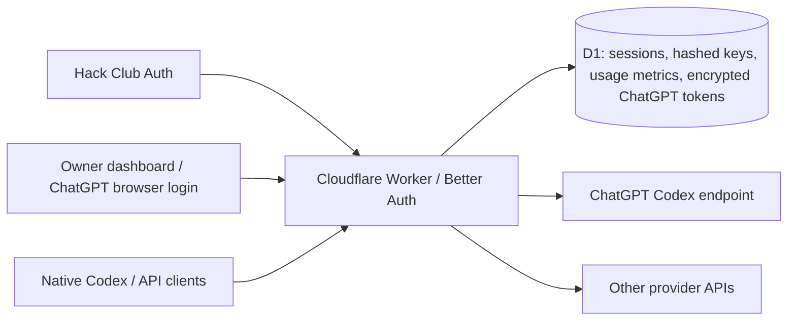

# Friends AI Proxy

A private AI gateway running entirely in a Cloudflare Worker, with Hack Club sign-in, Better Auth sessions, personal API keys, and native Codex CLI support. The Worker connects directly to ChatGPT and other configured providers.

**Deployment:** [relay.raygen.dev](https://relay.raygen.dev). The owner has connected ChatGPT, but live testing on September 19, 2026 found that ChatGPT returns an HTML HTTP 403 to this Worker’s subscription requests. Live inference is blocked. Account model discovery, native CLI metadata, and protocol handling are implemented and tested against controlled upstreams; the dashboard reports upstream unavailability rather than inventing a model list. See [the integration report](docs/integration-check.md).

## Connect ChatGPT

1. Open [the admin dashboard](https://relay.raygen.dev/admin) and sign in with Hack Club. The configured owner is `ident!R9zf0a`.
2. In **ChatGPT connection**, choose **Generate sign-in link**, then open the generated OpenAI URL.
3. Sign in with ChatGPT. The browser redirects to `http://localhost:1455/auth/callback?...`. The page may fail to load; this is expected when no local Codex login server is running.
4. Copy the **entire final URL** from the address bar into the dashboard's callback field and finish connecting. Do not share that URL: it contains a short-lived authorization code.

The Worker generates PKCE and state, validates the pasted callback, and exchanges the code directly with OpenAI. No local relay is needed. The callback must remain the native Codex localhost URL; the dashboard's domain is not an approved redirect for OpenAI's native client. Login links expire after 15 minutes. Device-code authentication is also available when enabled for your account. See [Codex authentication](https://learn.chatgpt.com/docs/auth).

Only the configured owner can manage this connection. Reconnecting keeps the previous credentials until the replacement login succeeds. **Disconnect account** removes the stored connection and pending sign-in; already running requests may finish.

The Hack Club OAuth redirect URI remains:

```text
https://relay.raygen.dev/api/auth/callback/hackclub
```

## Manage your circle

The black dashboard at [`/admin`](https://relay.raygen.dev/admin) includes usage analytics, a member leaderboard, invitations, member controls, and the shared ChatGPT connection.

- **Invite someone:** create a single-use link, copy it, and send it yourself. Links expire after seven days. You can optionally restrict a link to one Hack Club identity. The full link is shown only when created; the database stores its hash.
- **Join:** a friend opens the link, signs in with Hack Club, and accepts. They then create their own API keys or approve a terminal login. Signing in alone does not grant model access.
- **Manage access:** suspend or restore a member, or permanently revoke all their keys. Suspension blocks subsequent API requests and dashboard access, including existing sessions and keys. Restoring access re-enables unexpired keys that were not revoked. Requests already running can finish.
- **Cancel an invitation:** revoke it before acceptance. Used, expired, and revoked invitations cannot be redeemed again. Suspended members cannot bypass suspension with another invitation.

Invitations and membership changes take effect immediately without deployment. Ownership stays bound to `OWNER_HACKCLUB_ID`; members cannot invite others or promote themselves.

## Architecture



All authentication, credential refresh, protocol conversion, and inference forwarding run in the Worker. Upstream requests originate from Cloudflare.

ChatGPT access and refresh tokens, and pending browser/device login credentials, are encrypted before storage in D1 using the `CODEX_TOKEN_KEY` Worker secret. The Worker refreshes access tokens on demand. D1 locks and version checks coordinate refresh across Worker instances and prevent an interrupted login or refresh from restoring a disconnected account. The browser receives connection status and the sign-in URL or one-time device approval code, never account tokens.

The Codex backend uses fixed OpenAI authentication endpoints and `https://chatgpt.com/backend-api/codex/responses`, the subscription endpoint used by native Codex. This is an experimental integration with the native subscription protocol; it is not the billed OpenAI API or a guarantee of account eligibility or future compatibility. See [the Codex agent loop](https://openai.com/index/unrolling-the-codex-agent-loop/) and [Codex authentication](https://learn.chatgpt.com/docs/auth).

## API and access

| Endpoint | Supported behavior |
| --- | --- |
| `GET /v1/models` | Account model catalog and configured provider aliases |
| `POST /v1/messages` | Anthropic-style text, images, client tools, tool results, SSE |
| `POST /v1/chat/completions` | OpenAI-style chat, images, client tools, tool results, SSE |
| `POST /v1/responses` | Stateless Responses API, streamed text and tools, Codex tool namespaces and custom tools |
| `/api/auth/*` | Better Auth + Hack Club OAuth with PKCE |
| `/api/keys` | Browser-session key creation and revocation |
| `/api/cli/*` | Browser-approved terminal login and key revocation |
| `/api/admin/codex` | Owner-only ChatGPT connection status and disconnect |
| `/api/admin/codex/browser/start`, `/api/admin/codex/browser/complete` | Owner-only browser login link and callback exchange |
| `GET /api/analytics?days=7` | Member-only 7- or 30-day usage metrics and leaderboard |
| `/api/admin/codex/start`, `/api/admin/codex/poll` | Owner-only ChatGPT device login |
| `/api/admin/overview`, `/api/admin/members/*`, `/api/admin/invites*` | Owner-only membership, usage, and invitations |
| `/api/session`, `/api/invites/accept` | Authenticated invitation onboarding |

Use `Authorization: Bearer ap_...` or Anthropic's `x-api-key: ap_...` with **proxy-issued** keys. Keys are shown once, stored as SHA-256 hashes, expire after 90 days, and are limited to 20 active keys per user. Access is checked against current membership on every request. `ALLOWED_HACKCLUB_IDS` remains a bootstrap fallback; an explicit database membership overrides it, while the configured owner always retains access.

There are no daily quotas. A short-window limit of 20 generation attempts per minute **per user**, shared across that user's keys, prevents bursts. Rate limits are atomic in D1; a failed upstream attempt still counts. The shared ChatGPT account permits two simultaneous requests. Excess requests receive `429` with `Retry-After`.

## Analytics

Active members can view shared usage analytics and a leaderboard for the last 7 or 30 UTC calendar days. The leaderboard ranks the top 50 members by total tokens, then requests, with requests, input/output tokens, issued tool calls, days active, and last activity. Dashboard cards and daily charts include active members, model usage, success rate, and average request duration.

Tracking begins with this deployment; earlier usage is not reconstructed. Each valid generation admitted by the local rate limiter creates one D1 metadata row. Upstream rejections count as failed attempts; streaming errors and client cancellations are recorded separately. Authentication failures, gateway parsing failures, and per-minute rate-limit rejections are excluded. Provider-specific validation, connection failures, and shared-account concurrency rejections count as failed attempts. Token counters use the latest cumulative usage reported by the provider, so interrupted streams can have incomplete token totals. Cached tokens are a subset of input tokens and are not added twice. Tool calls count calls issued by the model, not verified execution. Duration spans upstream processing and stream consumption. In-flight requests appear in request totals; a Worker interrupted before its final write can leave an unfinished record.

No chats, code sessions, PRs, or time-saved estimates are inferred. Aggregate history stays in D1; its indexed time window queries power the dashboard. Members see display names and usage totals, never each other's emails, API keys, or account identifiers. The owner retains the separate member-management view.

The application does not store prompts, generated text, or tool payloads. Better Auth encrypts Hack Club OAuth tokens. Infrastructure logs and the upstream provider have their own retention policies.

## Native Codex for friends

Install Node.js 22 or newer and the native `codex` CLI. From this project's directory:

```sh
npm ci
npm run client -- login --url https://relay.raygen.dev
# Check the terminal code in your browser, sign in with Hack Club, and approve it.
npm run client -- codex
```

The helper launches the **installed native Codex executable** with a Responses provider and injects your personal proxy key. It does not replace Codex or modify your existing Codex configuration or authentication. Other Codex arguments pass through:

```sh
npm run client -- models
npm run client -- codex --model MODEL_ID exec 'Explain this project'
npm run client -- logout
```

Login stores the key in `~/.config/ai-proxy/credentials.json` (or under `XDG_CONFIG_HOME`) with mode `0600`. Logout revokes that key at the proxy and removes the local copy. CLI login codes expire in 10 minutes; approval and redemption are single-use.

To configure Codex yourself, add this to your user-level Codex config and supply your proxy key through the environment:

```toml
model = "MODEL_ID_FROM_THE_GATEWAY"
model_provider = "friends_proxy"
web_search = "disabled"

[model_providers.friends_proxy]
name = "Friends AI Proxy"
base_url = "https://relay.raygen.dev/v1"
wire_api = "responses"
env_key = "AI_PROXY_API_KEY"
```

```sh
export AI_PROXY_API_KEY="$(node /absolute/path/to/ai-proxy/bin/ai-proxy.mjs token)"
codex
```

The project's login helper authenticates friends with Hack Club. The dashboard's **Connect ChatGPT** action authenticates the shared upstream account. The helper fetches the connected account’s actual model catalog, selects its default model, and supplies the native metadata through a temporary `model_catalog_json` file. The model picker therefore uses the account’s names, reasoning levels, and context windows. The file is removed when Codex exits. Manual configuration without this catalog may use Codex’s built-in model metadata instead. See [Codex custom providers](https://learn.chatgpt.com/docs/config-file/config-advanced#custom-model-providers).

## Local development

```sh
npm ci
cp .dev.vars.example .dev.vars
```

1. Create a [Hack Club OAuth application](https://auth.hackclub.com/docs/oauth-guide). Register `http://localhost:8787/api/auth/callback/hackclub` with the `email` and `name` scopes.
2. Put `HACKCLUB_CLIENT_ID` and `HACKCLUB_CLIENT_SECRET` in `.dev.vars`. Set a random `BETTER_AUTH_SECRET` of at least 32 characters.
3. Generate 32 random bytes encoded as base64url and save them as `CODEX_TOKEN_KEY` in `.dev.vars`. For example, `node -e 'console.log(require("node:crypto").randomBytes(32).toString("base64url"))'`.
4. Set `OWNER_HACKCLUB_ID` to your immutable Hack Club identity (`ident!...`). Optionally set `ALLOWED_HACKCLUB_IDS` for bootstrap members; invite everyone else from the dashboard. Ownership is explicit, never assigned to the first person to sign in. Other people may sign in to accept an invitation, but cannot use the proxy until granted access.
5. Apply migrations and start the Worker:

   ```sh
   npm run db:migrate
   npm run dev
   ```

Open `http://localhost:8787`, sign in, and connect ChatGPT from the owner dashboard. Local development uses its own database and connection. Obtain identity IDs from Hack Club Auth identity records; the [identity API](https://auth.hackclub.com/docs/api) documents `identity.id`.

## Adding providers

`PROVIDERS_JSON` is a JSON array in Worker configuration. Each entry has a unique ID, protocol, and public-alias-to-upstream-model mapping. Model aliases must be unique across providers.

The production Codex configuration is:

```json
[
  {
    "id": "codex",
    "protocol": "codex",
    "discoverModels": true,
    "models": {}
  }
]
```

With `discoverModels: true`, the gateway fetches the connected account’s catalog and caches it in D1 for five minutes, fenced to the owner and connection version. Both `/api/models` (browser session) and `/v1/models` (gateway key) return the real model IDs. Optional `models` aliases remain supported; the old `codex` name resolves to the current default for existing clients but is not advertised as a model. Codex obtains its credentials from the encrypted owner connection. Its upstream URL and authentication settings are fixed in the adapter.

API-key providers additionally specify a fixed base URL, a secret binding name, and optional authentication style. Configuration contains **no secret values**. For example, add these entries alongside Codex:

```json
[
  {
    "id": "anthropic",
    "protocol": "anthropic",
    "baseUrl": "https://api.anthropic.com/v1",
    "credential": "ANTHROPIC_API_KEY",
    "auth": "x-api-key",
    "models": { "claude": "claude-sonnet-4-6" }
  },
  {
    "id": "openai",
    "protocol": "openai-responses",
    "baseUrl": "https://api.openai.com/v1",
    "credential": "OPENAI_API_KEY",
    "models": { "openai": "YOUR_OPENAI_API_MODEL_ID" }
  }
]
```

The generic adapters are `anthropic`, `openai-chat`, and `openai-responses`. Bearer authentication is the default. DeepSeek or Kimi can use `openai-chat` with their API base URL, API key binding, and available model ID; verify [DeepSeek](https://api-docs.deepseek.com/) and [Kimi](https://platform.kimi.ai/docs/overview) settings before enabling them. Model-specific thinking settings and continuation requirements may need an adapter extension. These providers have not been tested against live accounts.

For a different protocol, implement `Provider.open()` in `src/providers/`: it receives a normalized conversation and an abort signal and returns the normalized event stream. Add its configuration variant and factory branch. Client authentication, analytics, and all three public API encoders remain reusable.

## Deployment

The production gateway is [relay.raygen.dev](https://relay.raygen.dev) in the Raygen Cloudflare account. Its D1 database and Hack Club OAuth credentials are provisioned. `env.production.vars` in `wrangler.jsonc` sets:

- `BETTER_AUTH_URL=https://relay.raygen.dev`
- `OWNER_HACKCLUB_ID=ident!R9zf0a`
- `ALLOWED_HACKCLUB_IDS=ident!R9zf0a`
- The `codex` provider configuration above.

Invite friends from the admin dashboard. Keep `OWNER_HACKCLUB_ID` set to the account owner.

For an existing deployment:

```sh
npm run check
npx wrangler d1 migrations apply ai-proxy --remote --env production
npm run deploy
```

For a fresh deployment, create the D1 database with `npx wrangler d1 create ai-proxy --env production`, put its returned ID in the production `DB` binding, and configure the public origin and custom domain before deploying. Register `https://relay.raygen.dev/api/auth/callback/hackclub` for the current production origin, or the corresponding callback path for your own domain.

Provision these Worker secrets when creating a deployment:

```sh
npx wrangler secret put BETTER_AUTH_SECRET --env production
npx wrangler secret put HACKCLUB_CLIENT_ID --env production
npx wrangler secret put HACKCLUB_CLIENT_SECRET --env production
node -e 'process.stdout.write(require("node:crypto").randomBytes(32).toString("base64url"))' | npx wrangler secret put CODEX_TOKEN_KEY --env production
```

Keep `CODEX_TOKEN_KEY` stable across deployments; replacing it makes the stored ChatGPT connection unreadable. Disconnect the account before replacing the key, then reconnect afterward. Add API-key secrets only for providers you configure.

After deployment, the owner signs in to the dashboard and connects ChatGPT. Verify an actual model request before inviting friends. No Cloudflare resources are provisioned by `npm run build`; it is a deployment dry run. `npm run deploy` targets production.

Worker invocation logs and traces are enabled with 100% sampling in `wrangler.jsonc`. Query strings are redacted from observability URLs. Application error logs contain request IDs and fixed error codes, not prompts or credentials. Traces are available in the Worker's Cloudflare **Observability** page; see [Cloudflare tracing](https://developers.cloudflare.com/workers/observability/traces/).

## Compatibility boundaries

- Conversations are stateless. Send complete history and `store: false`; `previous_response_id`, stored conversations, and background responses are rejected.
- Tool execution happens in the client. Codex namespaces are mapped to stable upstream names and restored in replies. Custom tools use a JSON string wrapper upstream; grammar constraints are described to the model rather than enforced by a grammar engine.
- The adapters cover text, image inputs, and client tools. Audio, files/documents, provider-hosted tools, structured outputs, token-count endpoints, realtime/WebSockets, and Responses compaction are not implemented.
- Codex subscription requests always stream upstream and disable storage. Sampling controls and stop sequences are rejected. The adapter omits `max_output_tokens`, so caller-requested output-token limits are not enforced for this backend. Assistant message phase is preserved through Responses input, output, and conversation replay.
- Reasoning contents and encrypted reasoning are not retained or replayed. Requested thinking configuration is rejected for Anthropic inputs. Responses reasoning effort, summary, and context are validated and forwarded to compatible providers. Cache-control hints and other provider-specific metadata are not forwarded. This is a supported subset of the protocols, not a complete API clone.
- Request bodies are limited to 1 MiB, generated content to 2 MiB, and requested output to 32,768 tokens for upstreams that support token caps. Requests time out after five minutes. A client disconnect cancels its upstream request. The Codex adapter retries once after an authentication rejection and token refresh, before generated content; generation failures are not automatically retried.
- All approved users can access every configured alias. Analytics record attempts and provider-reported tokens. There is no billing, per-model entitlement system, account pool, or automatic failover.
- Live ChatGPT subscription inference currently fails with an upstream HTML 403 from this Worker. Successful OAuth sign-in does not establish inference availability. Credentials are provisioned privately and are not included in source control.

## Development and verification

```sh
npm run check        # TypeScript + unit/Worker/client tests + deploy dry run
npm run test:codex   # Native Codex against Anthropic, Responses, and direct Worker mocks
npm run types       # Regenerate Workers bindings and runtime types
npm run auth:generate
npm run db:generate  # Generate a migration after schema changes
```

Tests cover owner authorization, encrypted ChatGPT credential storage and refresh, browser PKCE and device login, analytics aggregation and cancellation tracking, upstream Responses lifecycle validation, Hack Club's mocked OAuth callback, Better Auth sessions in D1, CSRF checks, key hashing and revocation, allowlist removal, concurrent rate limits, one-time CLI approval, protocol conversion, UTF-8 SSE fragmentation, tools, and stream failure and cancellation.

The Codex smoke test creates an ephemeral database and temporary working directory, runs a harmless shell tool, checks that its result arrives on the next request, and verifies the final streamed answer. It makes no model-provider requests.

Live integration testing runs the native Codex CLI in an isolated Docker container against an already deployed gateway:

```sh
npm run test:docker -- --live --url https://relay.raygen.dev \
  --key-file /absolute/path/to/a/temporary-proxy-key
```

The key file must contain a gateway key, not a ChatGPT token. The container receives it as a read-only runtime mount, has a temporary home/workspace, and never mounts host Codex credentials. This test makes real requests: streaming and buffered calls through all three protocols, native model discovery, and a Codex shell tool write/read round trip. It fails on upstream rejection, missing usage, stream failures, a mismatched model list, or missing tool execution. Revoke the temporary key afterward.
